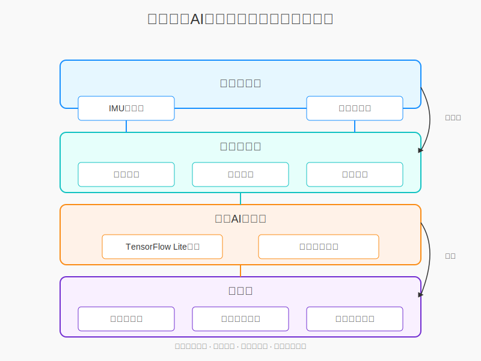

# 中长跑实时指导系统

基于多模态传感器和边缘AI的中长跑实时姿态分析与指导系统。该系统利用IMU和足压传感器数据，在设备本地进行实时分析，为跑者提供姿态评分、步态分析和改进建议。

## 功能特性

- **实时数据分析**：采集IMU和足压传感器数据，进行实时信号处理和特征提取
- **步态相位检测**：利用AI模型识别支撑相和摆动相，分析跑步周期
- **姿态评分**：基于多维度指标给出综合跑步姿态质量评分
- **足压分析**：分析足部着地方式和压力分布
- **改进建议**：根据分析结果提供个性化的改进建议
- **历史数据**：保存训练历史，支持长期进步追踪
- **深度分析**：提供详细的步态分析报告和对比功能

## 技术栈

- **前端**：HTML, CSS, JavaScript, ECharts
- **后端**：Python, Flask, Socket.IO
- **数据处理**：NumPy, SciPy, Pandas
- **AI推理**：TensorFlow Lite
- **系统架构**：边缘计算架构，无需云服务支持

## 系统架构



详细架构信息请参考[架构设计文档](docs/architecture.md)。

## 快速启动

我们提供了便携式启动脚本，可以自动处理环境设置、依赖安装和系统启动，让您快速体验系统功能。

```bash
# 启动系统
python run.py
```

启动脚本会自动：
1. 检查Python环境
2. 创建并配置虚拟环境
3. 安装必要的依赖项
4. 准备示例数据（如果不存在）
5. 启动Web服务器
6. 在默认浏览器中打开应用界面

启动后，您可以通过浏览器访问 `http://localhost:5000` 使用系统。

## 详细安装方法

如果您想手动设置环境，可以按照以下步骤进行：

### 环境要求

- Python 3.8+
- 支持的操作系统：Windows, macOS, Linux (推荐Raspberry Pi 4用于便携式部署)

### 详细安装步骤

1. 克隆仓库（或解压下载的项目文件）：

```bash
git clone https://github.com/yourusername/running-guidance-system.git
cd running-guidance-system
```

2. **创建虚拟环境**（强烈推荐）：

```bash
# Windows系统
python -m venv venv
venv\Scripts\activate

# macOS/Linux系统
python3 -m venv venv
source venv/bin/activate
```

3. 安装依赖：

```bash
pip install -r requirements.txt
```

4. 如果在安装TensorFlow Lite时遇到问题，可以尝试：

```bash
# 替代方案：直接安装TensorFlow (包含TF Lite功能)
pip install tensorflow==2.16.1
```

5. 安装Flask-SocketIO相关依赖：

```bash
pip install Flask-SocketIO==5.3.6 python-socketio==5.10.0 python-engineio==4.8.0
```

### 目录结构准备

确保以下目录结构存在：

```bash
# 创建模型目录
mkdir -p edge_ai/models

# 创建数据目录
mkdir -p data
```

### 硬件设置（可选）

如果您有兼容的IMU和足压传感器：

1. 将传感器连接到系统
2. 修改配置文件指定传感器接口

## 使用方法

### 启动系统

1. 确保已激活虚拟环境：

```bash
# Windows
venv\Scripts\activate

# macOS/Linux
source venv/bin/activate
```

2. 启动Flask应用：

```bash
# 启动Web服务器
python -m web_ui.app
```

3. 在浏览器中访问：`http://localhost:5000`

### 使用模拟数据

系统默认使用内置的样例数据进行模拟。在web界面中：

1. 访问实时仪表盘页面
2. 点击"开始采集"按钮
3. 观察实时数据分析结果
4. 点击"停止采集"保存当前会话数据

### 使用真实传感器数据

1. 确保传感器正确连接
2. 在仪表盘页面选择"真实传感器"模式
3. 启动数据采集
4. 开始跑步，系统将实时分析您的数据

## 常见问题解决

### 依赖安装问题

- **问题**: `ModuleNotFoundError: No module named 'flask_socketio'`
- **解决方案**: 确保已安装Flask-SocketIO及其依赖：
  ```bash
  pip install Flask-SocketIO==5.3.6 python-socketio==5.10.0 python-engineio==4.8.0
  ```

- **问题**: `ModuleNotFoundError: No module named 'tensorflow'`
- **解决方案**: 尝试直接安装完整的TensorFlow：
  ```bash
  pip install tensorflow==2.16.1
  ```

### 运行时问题

- **问题**: 无法启动Flask应用
- **解决方案**: 确保已激活虚拟环境，并且所有依赖都已正确安装

- **问题**: 无法访问Web界面
- **解决方案**: 确保Flask服务器正在运行，并尝试访问 http://localhost:5000

## 项目结构

```
|-- sensor_processing/    # 传感器数据处理模块
|   |-- __init__.py
|   |-- data_processor.py    # 数据处理主类
|   |-- feature_extractor.py # 特征提取
|   |-- filter.py            # 信号滤波
|
|-- edge_ai/              # AI推理模块
|   |-- __init__.py
|   |-- inference.py         # 推理引擎
|   |-- models/              # 模型文件目录
|       |-- gait_model.tflite  # 步态分析模型(需自行添加)
|       |-- model_info.txt     # 模型信息
|
|-- web_ui/               # Web界面模块
|   |-- __init__.py
|   |-- app.py              # Flask应用
|   |-- templates/          # HTML模板
|   |-- static/             # 静态资源
|       |-- css/            # 样式文件
|       |-- js/             # JavaScript文件
|       |-- images/         # 图片资源
|
|-- data/                 # 数据目录
|   |-- sample_data.json    # 示例数据
|
|-- tools/                # 工具脚本
|   |-- decode_data.py      # 数据解码工具
|   |-- model_converter.py  # 模型转换工具
|
|-- docs/                 # 文档
|   |-- architecture.md     # 架构设计
|   |-- system_architecture.svg  # 架构图
|
|-- run.py                # 便携式启动脚本
|-- requirements.txt      # 依赖列表
|-- README.md             # 本文档
```

## Web界面

系统提供四个主要页面：

1. **首页**：系统介绍和入口
2. **实时仪表盘**：显示实时数据和分析结果
3. **历史数据**：查看历史训练记录和趋势
4. **深度分析**：提供详细的步态分析和改进建议

## 模型说明

系统使用轻量级TensorFlow Lite模型，专为边缘设备优化。主要功能：

- 步态相位识别
- 姿态评分
- 跑步效率分析

## 数据格式

系统使用JSON格式存储和交换数据，包含以下主要字段：

- `timestamps`：时间戳数组
- `acceleration`：加速度数据数组 [x, y, z]
- `gyroscope`：角速度数据数组 [x, y, z]
- `pressure`：足压数据数组 [前脚掌, 中脚掌, 后脚掌, 外侧]
- `gait_labels`：步态相位标签数组

## 许可证

[MIT License](LICENSE)

## 贡献指南

欢迎提交Pull Request或Issue。贡献时请遵循以下原则：

1. 遵循现有的代码风格
2. 为新功能添加适当的测试
3. 更新相关文档

## 联系方式

如有问题或建议，请联系：example@example.com

---
最后更新：2025-03-27
